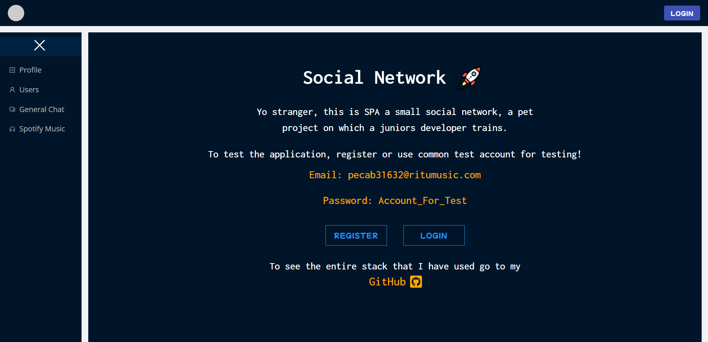
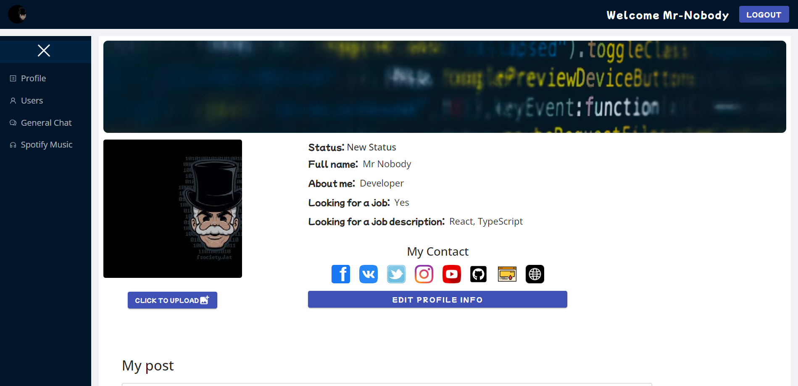
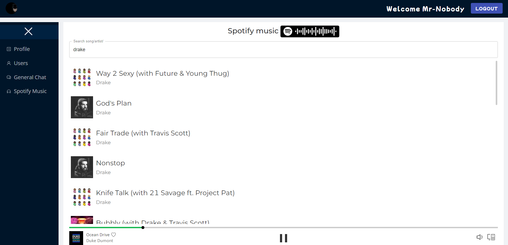
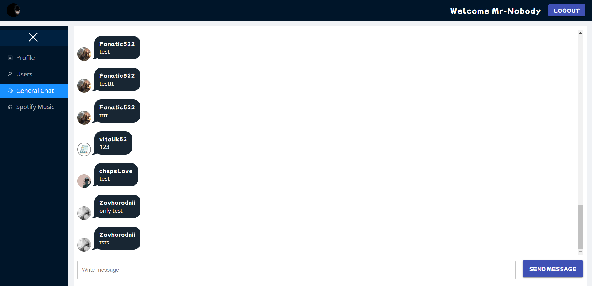

# Social network [Website](https://mr-g3ntl3man.github.io/Social_Network)

### Social network, project on which a juniors developer trains.

### From the available options:

- The profile that you can edit.
- View the profiles of other users.
- Listening to music with Spotify.

## UI Screenshots

## Stack

- [React](https://ru.reactjs.org/) - JavaScript library for creating user interfaces.
- [Redux](https://redux.js.org/) - A Predictable State Container for JS Apps
- [Ant design ](https://ant.design/) - A design system for enterprise-level products. Create an efficient and enjoyable
  work experience.
- [MUI](https://mui.com/) - MUI provides a robust, customizable, and accessible library of foundational and advanced
  components, enabling you to build your own design system and develop React applications faster.
- [Other dependencies](https://github.com/Mr-G3ntl3man/Social_Network/blob/master/package.json)